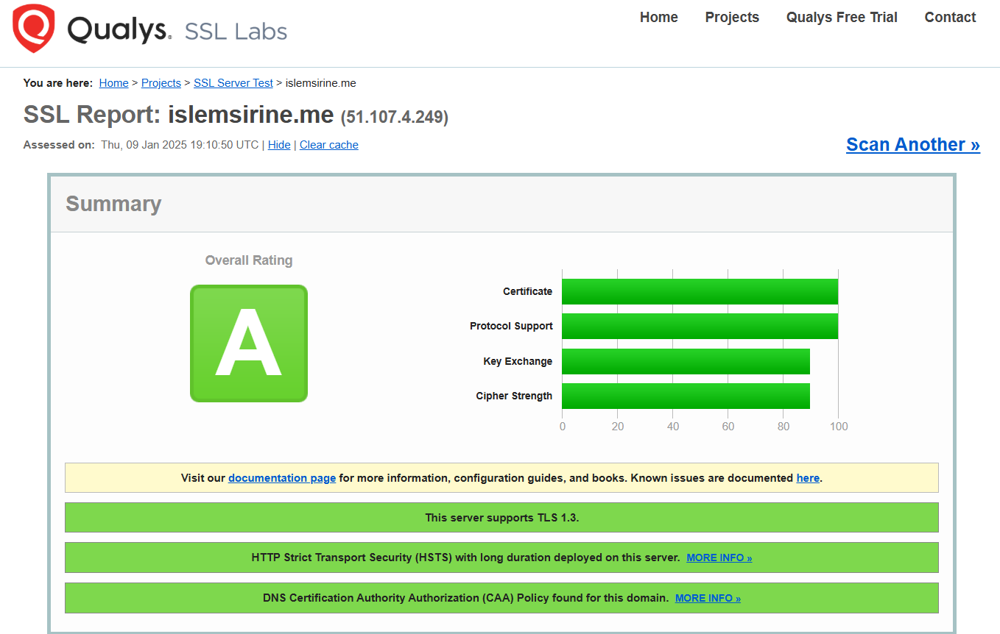

# Welcome to islemsirine.me 🌐

This website is created by **Islem Kammoun** and **Sirine Ltaief**, students in the **CySed class at SUP'COM**.  
It serves as a platform to showcase our skills, projects, and passion for cybersecurity and technology.

## Functionalities

- **Secure Configuration**: This website is configured with **TLS 1.3** and **HSTS** (HTTP Strict Transport Security) to ensure secure communication and protect against common web vulnerabilities.

-- **Steganography with java*: This code is in Java and can embed and extract a secret message from an image .
  

## About Us

We are dedicated to:
- Exploring innovative solutions in cybersecurity and system engineering.
- Sharing our knowledge and insights with the community.
- Developing impactful projects that reflect our academic and professional growth.

## Get in Touch

Visit: [islemsirine.me](https://islemsirine.me)  
Reach out to us for collaborations, discussions, or feedback.

---

Thank you for visiting **islemsirine.me**!  
Your support and interest inspire us to grow and create. 🚀
